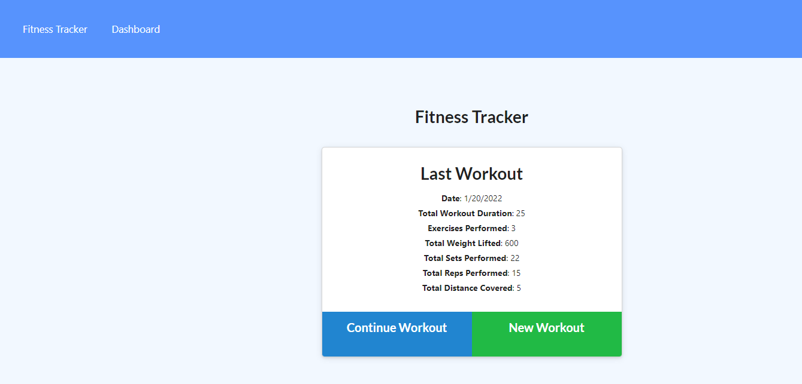

Helpful Workout Tracker

Tracy Torisky

ttorisky@gmail.com

The user is able to view, create and track daily workouts.  They are able to log multiple exercises in a workout on any given day.  They will also have the ability to track the name, type, weight, sets, reps, and duration of the exercises.  They will also be able to track the distance traveled.

Using this tracker will help reach fitness goals more quickly.

Upon loading the page, the user is given the option to create a new workout or continue with the last workout.  The user can add exercises to the most recent workout plan, add new exercises to a new workout plan, view the combined weight of multiple exercises from the past seven workouts, and view the total duration of each workout from the past seven workouts.

